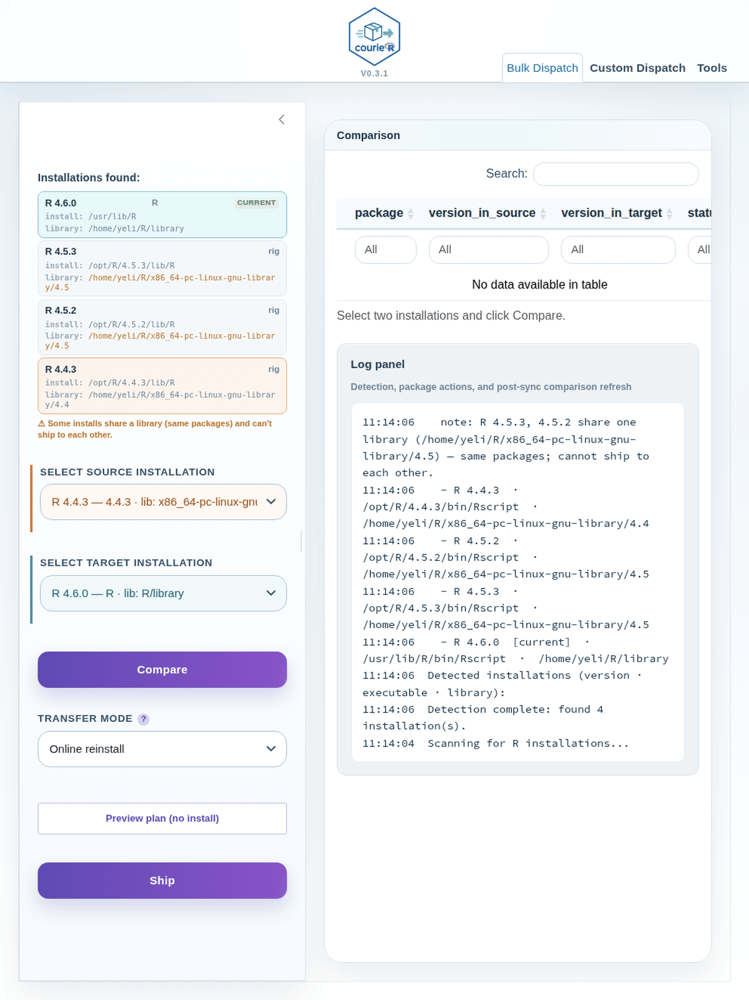
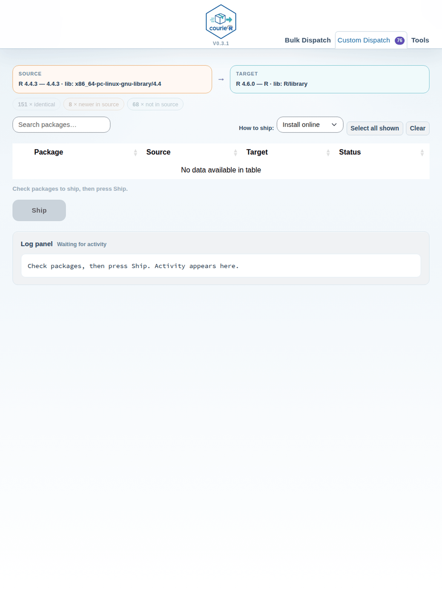

# courieR

<!-- badges: start -->
[](https://github.com/lennon-li/courieR/actions/workflows/R-CMD-check.yaml)
[](https://lennon-li.github.io/courieR/)
[](https://lifecycle.r-lib.org/articles/stages.html#experimental)

<!-- badges: end -->

**[📖 Documentation →](https://lennon-li.github.io/courieR/)**

courieR syncs installed R packages between R versions on the same machine — migrate from old to new, or selectively copy packages from a source installation into a target installation. No manual reinstalling, no lost libraries.

> This package is fully AI-implemented — co-authored by Claude Fable, Claude
> Opus, Claude Sonnet, and OpenAI Codex via [Claude Code](https://claude.ai/code)
> — with the author directing requirements, reviewing every decision, and owning
> the outcome. A proof-of-concept for human–AI co-authorship in open-source R.

## Installation

Install from CRAN:

```r
install.packages("courieR")
```

Or install the development version from GitHub:

```r
pak::pkg_install("lennon-li/courieR")
```

## Quickstart

```r
library(courieR)
hub()                          # point-and-click dashboard

migrate("4.5.2", "4.6.0")     # one-line CLI migration
```

The dashboard detects all R installations on your machine, displays them in a header bar, and lets you compare and sync packages between any two.

## How It Works

courieR detects every R installation on your system, scans their package libraries, and lets you push packages from a source installation into a target installation — using [pak](https://pak.r-lib.org/) under the hood.

```
R 4.4.1  ──▶  compare()  ──▶  missing / outdated packages found
                          ──▶  ship() installs or upgrades into target R
```

### Installation Detection

`find_routes()` searches multiple sources per platform so it finds installs regardless of whether admin rights were used:

| Platform | Sources searched |
|---|---|
| **Windows** | HKLM registry (admin installs), HKCU registry (non-admin installs), `%ProgramFiles%\R`, `%LOCALAPPDATA%\Programs\R`, `%USERPROFILE%\Documents\R`, rig-managed versions |
| **macOS** | System R framework (`/Library/Frameworks`), user framework (`~/Library/Frameworks`), Homebrew (`/opt/homebrew`, `/usr/local`), rig-managed versions |
| **Linux** | `/opt/R` (rig system), `~/.local/share/rig/R` (rig user), conda environments, custom paths |

## Key Functions

| Function | What it does |
|---|---|
| `hub()` | Launch the Shiny dashboard |
| `migrate(from, to)` | One-call CLI migration between two R versions |
| `find_routes()` | Detect all R installations on the system |
| `manifest()` | List packages installed in an R version |
| `inventory()` | Compare two package libraries |
| `ship()` | Full-control migration (custom paths, callbacks) |

## Dashboard

Launch the interactive Shiny dashboard with:

```r
library(courieR)
hub()
```

The dashboard contains five flat tabs: **Bulk Dispatch**, **Browse**, **Custom Dispatch**, **Manifest**, and **Maintenance**.

### Bulk Dispatch

The **Bulk Dispatch** tab compares two R libraries and ships all missing or outdated packages in one operation.



**Workflow:**
1. The header bar shows all detected installations (highlighted in the source/target accent colours once selected).
2. Select a **source** and a **target** R installation from the dropdowns in the sidebar. The target list is constrained to same-or-newer R versions.
3. Click **Compare** — the coloured chips above the table show counts of identical, missing, and version-mismatched packages. By default, only packages *missing from target* are shown.
4. Click **Ship** — a confirmation dialog shows the package count and estimated duration, then installs/upgrades packages into the target.
5. The log pane and a live hero panel track delivery progress in real time.

The comparison table lists unmatched and outdated packages first, ahead of packages that already match. When sync finishes, courieR rescans both selected installations and refreshes the comparison automatically.

### Custom Dispatch

The **Custom Dispatch** tab lets you cherry-pick individual packages instead of bulk-shipping everything.



**Workflow:**
1. After running Compare in Bulk Dispatch, open the **Custom Dispatch** tab — the same comparison is shared instantly.
2. Use the coloured filter chips to narrow down the table (default: *missing from target*).
3. The **Repo** column shows each package's origin (CRAN, Bioconductor, GitHub, or red **unknown** for local/private packages).
4. Check the packages you want to ship, choose **Install online** or **Ship as-is**, and press **Ship N selected**.
5. The log pane and hero panel track custom progress in real time.

The remaining tabs cover narrower workflows: **Browse** inspects any single detected installation's package list, **Manifest** reports full inventory, and **Maintenance** restocks an installation from CRAN.

## CLI Usage

Prefer scripting? Use `ship()` directly:

```r
library(courieR)

routes <- find_routes()
print(routes[, c("version", "rscript_path")])

# dry run first
result <- ship(
  source_path = routes$rscript_path[1],
  target_path = routes$rscript_path[2],
  dry_run = TRUE
)
print(result$plan)

# for real (upgrade = TRUE ensures outdated packages are also updated)
result <- ship(
  source_path = routes$rscript_path[1],
  target_path = routes$rscript_path[2],
  upgrade = TRUE
)
```

## Requirements

- R >= 4.1
- Works on Windows, macOS, and Linux
- No packages required on the source R installation
- The target R installation needs `pak` available so it can install packages into
  its own library
